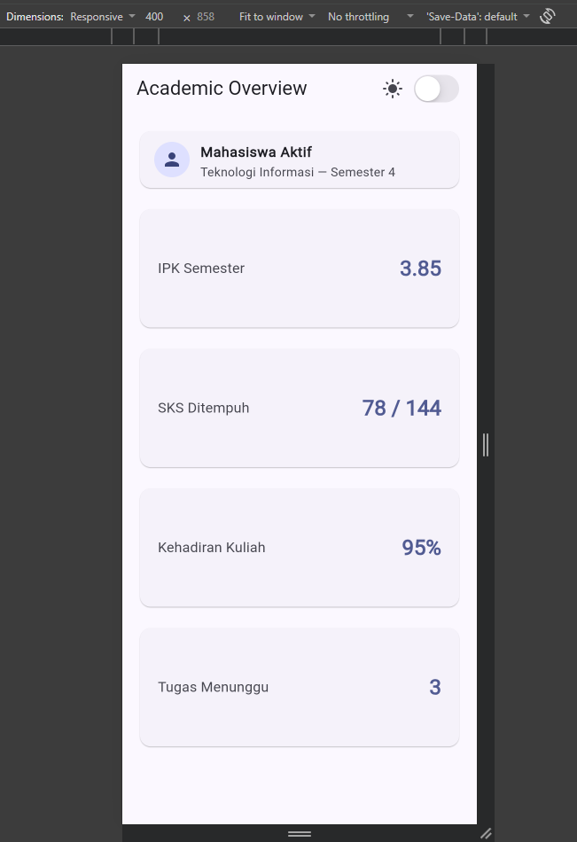
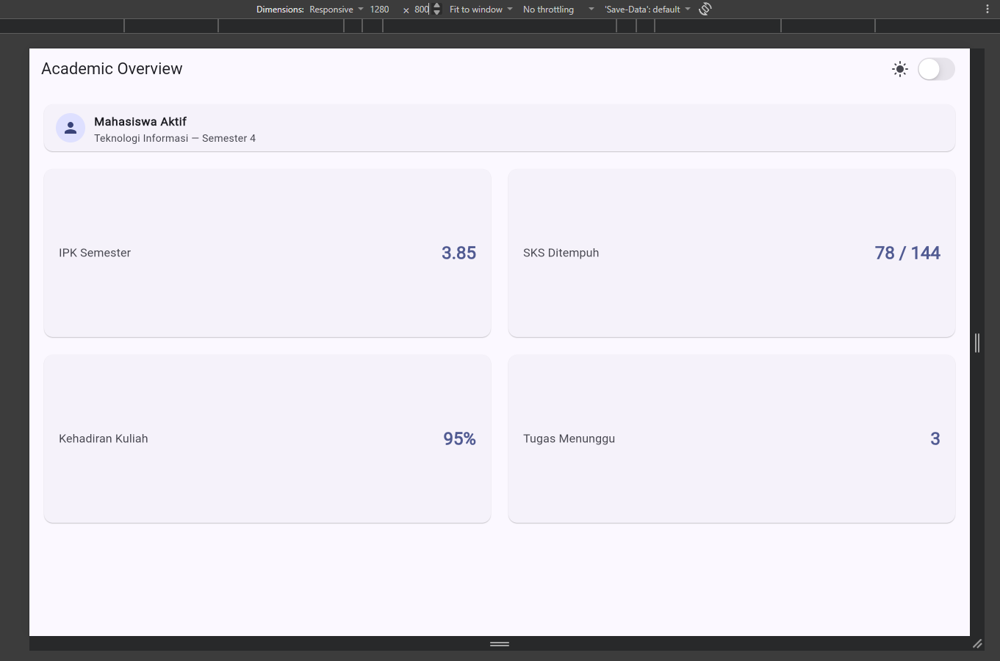
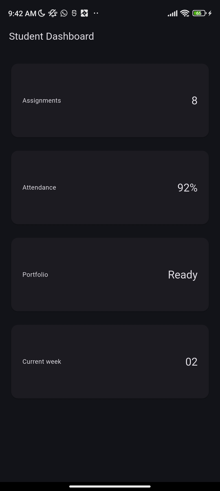
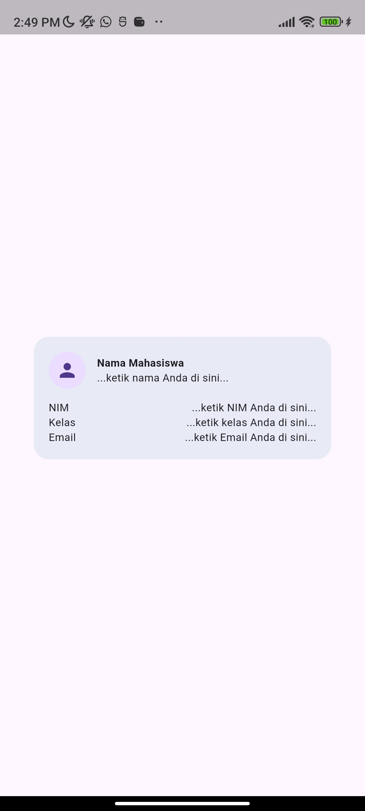
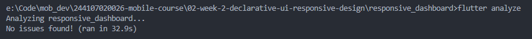
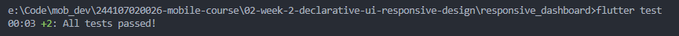

# Demo
1. Jalankan aplikasi hasil akhir pada emulator ukuran ponsel (misal 5"), lalu tablet (misal 10"); bandingkan jumlah kolomnya.

2. Aktifkan dark mode pada emulator/perangkat dan amati perubahan tema secara otomatis.

# Praktikum: layout sederhana (warm-up)

# Praktikum: dashboard responsif
1. Ubah breakpoint dari 700 menjadi nilai lain dan amati perubahan jumlah kolom.
.jpg)
2. Ubah themeMode menjadi ThemeMode.dark, lalu kembalikan ke ThemeMode.system.

3. Uji aplikasi dengan ukuran layar emulator yang berbeda.
.png)

# Tugas dan AI design exploration
* Tugas utama
Kembangkan dashboard menjadi halaman Academic Overview dengan ketentuan:

1. Memiliki header profil dan minimal empat kartu informasi.
2. Menggunakan Row, Column, Expanded, dan Container.
3. Menampilkan satu kolom pada layar sempit dan dua kolom pada layar lebar.
4. Menyediakan light theme dan dark theme yang tetap terbaca, dengan toggle tema (misal CupertinoSwitch atau Switch.adaptive).
5. Memiliki label aksesibilitas untuk informasi atau tombol penting.
6. Menyertakan screenshot layar sempit dan lebar pada folder screenshots/.

# AI Prompt Challenge
## A. Prompt Desain: GridView vs. LayoutBuilder + Column
Prompt : Bandingkan dua tata letak dashboard akademik untuk Flutter: versi GridView dan versi LayoutBuilder + Column. Jelaskan trade-off responsif dan aksesibilitasnya.
* Versi GridView:
Responsivitas: Ringkas ditulis karena cukup mengubah crossAxisCount. Namun, GridView membatasi dimensi kartu lewat childAspectRatio yang statis. Jika ukuran font sistem diperbesar oleh pengguna (fitur accessibility text scaling), teks di dalam GridView sangat rentan terpotong (text clipped).
Aksesibilitas: Pembaca layar mengidentifikasi grid sebagai tabel/koleksi berindeks, yang kadang kurang natural untuk alur kartu dasbor vertikal.

* Versi LayoutBuilder + Column/Row (Dipilih):
Responsivitas: Komponen kartu membungkus konten berdasarkan tinggi intrinsik (Card menyesuaikan teks di dalamnya). Saat font membesar, kartu meregang secara dinamis tanpa overflow.
Aksesibilitas: Navigasi TalkBack mengalir runtut dari atas ke bawah (linear reading order), ideal untuk dasbor status.

## B. Prompt Penguatan Konsep: Kapan Expanded Menyebabkan Overflow?
Prompt : Jelaskan kapan penggunaan Expanded justru menyebabkan overflow di dalam Row, beri contoh kode yang gagal dan perbaikannya.
1. Expanded di dalam Row memaksa anak mengisi ruang horisontal yang tersisa.
Penyebab kegagalan (Overflow): Menaruh Row berisikan Expanded di dalam widget scroll horisontal (SingleChildScrollView(scrollDirection: Axis.horizontal)). Di sini, lebar parent bernilai tak hingga (double.infinity). Expanded bingung menentukan lebar dan melempar error: "BoxConstraints forces an infinite width."

2. Isi teks di dalam Row yang tidak dibungkus Expanded melebihi batas layar, sementara elemen lain di-Expanded tanpa menyisakan ruang minimal.

Contoh gagal & perbaikan:

// GAGAL: crash bila di dalam SingleChildScrollView horizontal
SingleChildScrollView(
  scrollDirection: Axis.horizontal,
  child: Row(
    children: [
      Expanded(child: Text('Teks Panjang...')), // Error infinite width
    ],
  ),
);

// PERBAIKAN: Berikan batasan pasti atau gunakan Container/SizedBox
SingleChildScrollView(
  scrollDirection: Axis.horizontal,
  child: Row(
    children: [
      SizedBox(width: 250, child: Text('Teks Panjang...')),
    ],
  ),
);

## C. Verification Prompt (Audit Mandiri Rekomendasi)
Prompt: Periksa kembali rekomendasi layout di atas: apakah tetap responsif di bawah 600px, apakah mengurangi aksesibilitas, dan apakah ada widget yang tidak tersedia di Flutter stabil saat ini?
Responsif di bawah 600px: Terjamin, karena tata letak beralih ke 1 kolom dengan Column di dalam SingleChildScrollView.
Aksesibilitas: Terjaga lewat Semantics(container: true, excludeSemantics: true, label: ...) sehingga TalkBack membaca konteks utuh.
Ketersediaan Widget: Semua widget (Scaffold, LayoutBuilder, Row, Column, Expanded, Container, Card, Semantics) merupakan widget inti stabil Flutter.

# Refactoring challenge
Setelah tugas utama berjalan, rapikan kode Anda:
1. Ekstrak kartu informasi menjadi widget reusable (misal InfoCard) yang menerima title dan value, sehingga tidak ada duplikasi widget.
Kode diekstrak menjadi class `InfoCard` pada [`lib/main.dart`](lib/main.dart#L118-L163) yang menerima parameter `title` dan `value`.

2. Ganti warna dan ukuran yang di-hardcode dengan Theme.of(context) agar mengikuti tema terang/gelap secara otomatis.
Pada widget `InfoCard` di [`lib/main.dart`](lib/main.dart), warna dan tipografi dihubungkan langsung ke `theme.colorScheme.onSurfaceVariant`, `theme.colorScheme.primary`, dan `theme.textTheme`.

3. Pindahkan breakpoint ke satu konstanta bernama (misal const kWideBreakpoint = 700;) agar hanya didefinisikan satu kali.
Didefinisikan sebagai konstanta global `const double kWideBreakpoint = 700.0;` di baris teratas [`lib/main.dart`](lib/main.dart).

4. Jalankan flutter analyze dan pastikan tidak ada error maupun warning baru.

# Testing dasar
Tambahkan widget test di folder test/ untuk memverifikasi perilaku responsif. Override ukuran layar menggunakan tester.view:
Jalankan dengan flutter test. Kedua test harus lulus sebelum tugas dikumpulkan. Simpan hasil test pada folder test/ di folder tugas minggu ini.

# Refleksi dan referensi
1. Apa perbedaan cara berpikir imperative dan declarative saat membangun UI?
Imperative: Menulis kode line-by-line untuk mengubah widget secara langsung setiap kali ada data baru
Declarative: Menyusun tampilan berdasarkan state, jadi UI otomatis menyesuaikan sendiri saat datanya berubah

2. Kapan Expanded membantu dan kapan penggunaannya justru menghasilkan layout error?
Membantu: Mengisi sisa ruang kosong agar komponen pas dan tidak overflow
Error: Ditaruh di dalam widget scrollable horizontal/vertikal, karena batas ukurannya jadi hilang

3. Bagaimana breakpoint dan theme memengaruhi pengalaman pengguna?
Breakpoint: Menjaga tampilan tetap pas, tidak sempit di layar HP dan tidak terlalu renggang di layar lebar
Theme: Menjaga kenyamanan mata dan keterbacaan teks lewat pilihan light atau dark mode

4. Apa yang Anda verifikasi dari rekomendasi AI setelah tugas inti selesai?
Mengecek semantics tetap terpasang dengan benar dan test langsung di ukuran layar kecil agar tidak muncul garis overflow