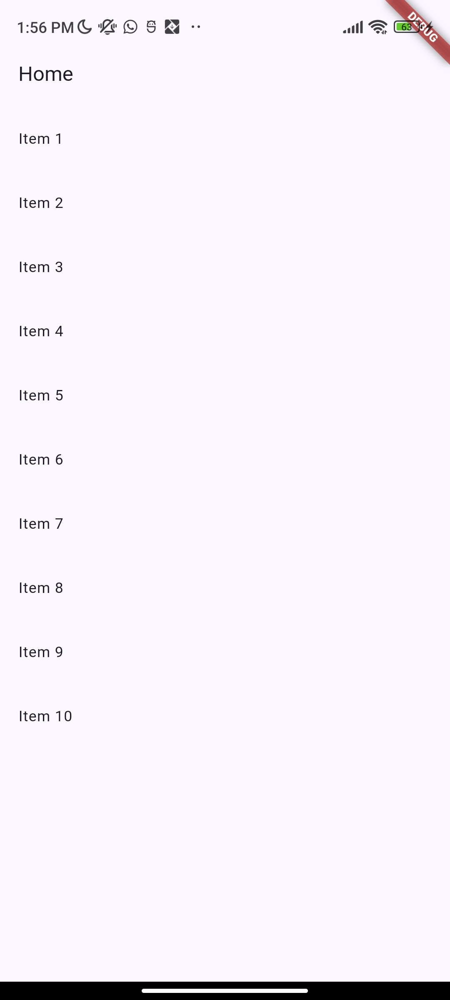
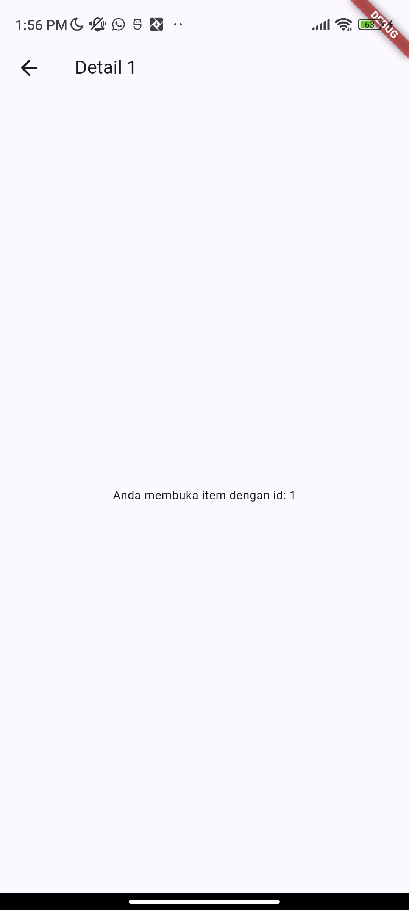
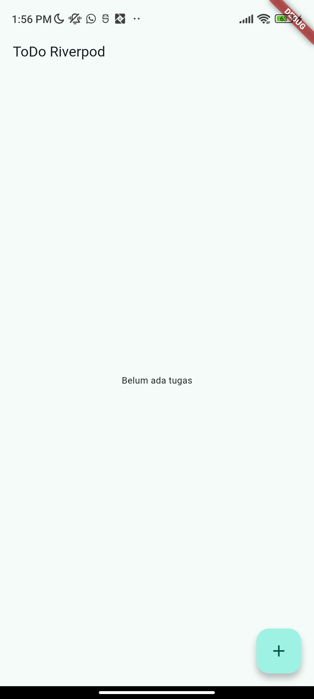
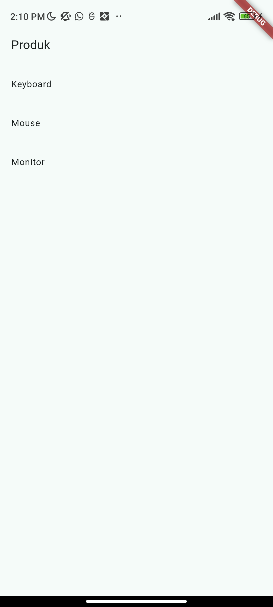
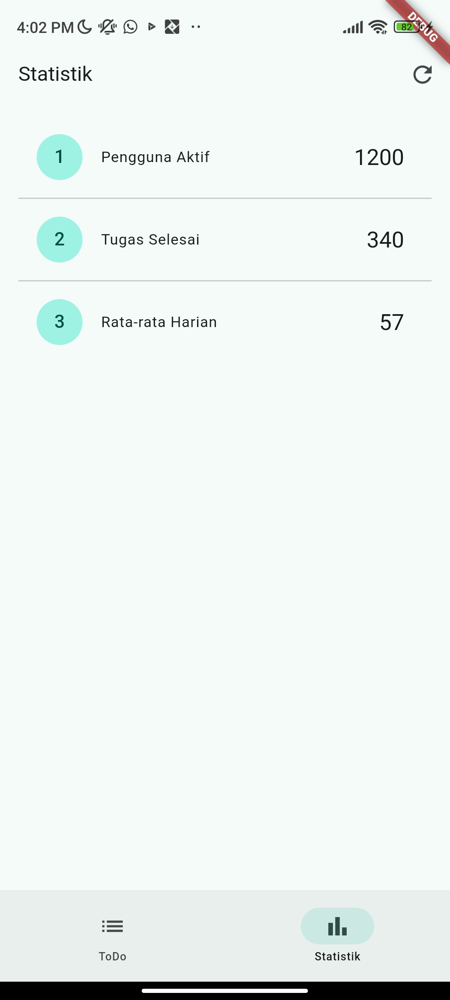

# Praktikum 1 - Aplikasi multi-page dengan GoRouter
1. Buat project baru
2. Susun struktur folder
## 1. Definisikan router di lib/main.dart:
- Kode ada pada [`lib/main.dart`](week3_todo/lib/main.dart)
## 2. Halaman Home (week3_todo/lib/pages/home_page.dart):

## 3. Halaman Detail (week3_todo/lib/pages/detail_page.dart):

## 4. Jalankan dan amati.

# Praktikum 2 - Aplikasi ToDo dengan Riverpod
## 1. Bungkus aplikasi dengan ProviderScope di lib/main.dart:
- Kode ada pada [`lib/main.dart`](week3_todo/lib/main.dart)
## 2. Buat state dan provider (week3_todo/lib/providers/todo_provider.dart):
- Kode ada pada [`lib/main.dart`](week3_todo/lib/providers/todo_provider.dart)
## 3. Tampilkan dengan ConsumerWidget (week3_todo/lib/pages/todo_page.dart):
- Kode ada pada [`lib/main.dart`](week3_todo/lib/providers/todo_provider.dart)
- 
## 4. Perhatikan pola penting: ref.watch di dalam build membuat halaman otomatis ter-rebuild saat daftar berubah; ref.read(todoListProvider.notifier) di dalam callback hanya memanggil method tanpa berlangganan.

# Praktikum 3
1. Salin kode di atas ke project ToDo Anda (atau project terpisah) dan jalankan. Amati tampilan loading selama 2 detik pertama.
- 
2. Ubah build() sementara untuk melempar error: throw Exception('Gagal terhubung ke server');. Jalankan dan amati UI error beserta tombol Coba lagi.
- 
3. Tekan tombol Coba lagi, ref.invalidate membuat provider dijalankan ulang. Pulihkan kode, pastikan state success tampil.
- 
4. Refleksikan: mengapa menampilkan ulang data lama (stale data) dengan indikator refresh kadang lebih baik daripada mengosongkan layar? Kapan pola itu penting?
Menampilkan data lama dan indikator refresh lebih baik daripada mengosongkan layar karena user tetap bisa melihat dan berinteraksi dengan konten yang ada, jika layar dikosongkan akan memberikan kesan aplikasi "rusak". Menurut saya pola ini penting di infinite scroll / pagination (situasi data lama masih relevan saat menunggu data baru)

# AI Verification Checklist
## 1. Prompt yang Digunakan
Buatkan halaman Flutter bernama StatsPage menggunakan flutter_riverpod.
Requirements:
- ConsumerWidget dengan satu AsyncNotifierProvider yang mensimulasikan
  pengambilan data statistik (delay 2 detik, kadang gagal 30%).
- UI harus menangani loading (spinner), error (pesan + tombol retry),
  dan success (ListView 3 item).
- Berikan unit test untuk notifier-nya.
Jelaskan setiap bagian kode dalam komentar.

## 2. Output Awal AI
AI menghasilkan tiga file:
- `lib/providers/stats_provider.dart` — model `Stat` + `StatsNotifier`
- `lib/pages/stats_page.dart` — UI `ConsumerWidget`
- `test/stats_notifier_test.dart` — 5 unit test

Sebelum kode AI diterima, verifikasi hal berikut dan catat temuan Anda di README:

1. Apakah state diubah secara immutable (tidak ada state.add() atau mutasi list langsung)?
- Iya, state diubah secara immutable. Tidak ada penggunaan state.add() atau mutasi langsung

2. Apakah ref.watch hanya dipakai di dalam build, dan ref.read di callback?
- Iya, ref.watch hanya diletakkan di dalam fungsi build untuk memantau perubahan data. Sedangkan ref.read hanya digunakan di dalam callback tombol

3. Apakah ketiga state AsyncValue benar-benar ditangani (bukan hanya success)?
- Iya, ketiga state sudah ditangani menggunakan metode .when(). Kode sudah menyediakan tampilan untuk kondisi loading, error, dan data sukses

4. Apakah provider dideklarasikan dengan tipe eksplisit dan tidak duplikat dengan provider lain?
- Iya, tipe data pada provider ditulis menggunakan AsyncNotifierProvider<StatsNotifier, List<Stat>> dan tidak ada duplikasi provider

5. Apakah kode AI memakai API Riverpod versi lama (StateProvider antipattern, StateNotifierProvider usang, atau Consumer bertingkat yang tidak perlu)? Perbaiki ke pola Notifier/ConsumerWidget.
- Tidak, kode AI sudah menggunakan API Riverpod versi terbaru (kode sudah pakai AsyncNotifier dan ConsumerWidget)

6. Jalankan flutter analyze dan flutter test, apakah hasil AI lolos tanpa warning?
- Lolos untuk flutter analyze, tapi hasil awal dari flutter test sempat gagal.

## 3. Perbaikan Hasil AI
- Kesalahan pada kode awal:
Saat menjalankan flutter test, tes ke-3 (skenario saat data gagal diambil) error. Penyebabnya adalah AI menggunakan invalidate() untuk tes kondisi error. Pada Riverpod, kode ini justru membuat status berubah menjadi AsyncLoading, bukan menghasilkan AsyncError.

- Perbaikan yang dilakukan:
Kode invalidate() pada file stats_notifier_test.dart telah diganti dengan memanggil fungsi refresh(). Setelah perbaikan, seluruh tes sudah berhasil.

# Refactoring dan testing
## 1. Refactoring Challenge
Lakukan refactoring berikut pada aplikasi ToDo Anda, lalu commit dengan pesan yang jelas:

1. Pisahkan widget bar ToDo menjadi TodoTile tersendiri agar build lebih pendek dan mudah diuji.
- Pemisahan UI untuk satu item tugas telah dilakukan dengan membuat widget `TodoTile` pada file [`lib/widgets/todo_tile.dart`](week3_todo/lib/widgets/todo_tile.dart).
2. Ekstrak logika filter (misal tampilkan hanya yang belum selesai) menjadi Provider turunan yang membaca todoListProvider.
- Logika filter telah dipisahkan dengan membuat `incompleteTodosProvider` pada [`lib/providers/todo_provider.dart`](week3_todo/lib/providers/todo_provider.dart).
3. Integrasikan aplikasi ToDo dengan GoRouter: / untuk daftar dan /stats untuk halaman statistik, tambahkan NavigationBar untuk berpindah.
- Aplikasi telah diubah untuk menggunakan `go_router` pada [`lib/main.dart`](week3_todo/lib/main.dart) menggantikan navigasi bawaan.

## 2. Testing
Widget test untuk memastikan UI bereaksi terhadap perubahan state provider. Jalankan seluruh verifikasi:
- Kode pengujian (widget test) untuk skenario "menambah tugas baru" telah ditambahkan dan disesuaikan di [`test/widget_test.dart`](test/widget_test.dart).

## 3. Checklist verifikasi mandiri
1. Navigasi GoRouter bekerja: pindah halaman, back, dan akses path detail langsung.

2. ProviderScope membungkus root aplikasi; state ToDo bertahan saat berpindah halaman.

3. UI AsyncValue menangani loading, error, dan success, bukan hanya success.

4. flutter analyze tanpa issue dan semua test lulus.

5. Hasil AI diverifikasi dan didokumentasikan pada folder docs/.

# Tugas, refleksi, dan referensi
## Mini project / Industry Challenge
Bangun aplikasi ToDo dengan navigasi dan Riverpod sebagai tugas minggu ini:

1. Minimal 2 halaman dengan GoRouter: daftar tugas, halaman detail/statistik.
2. State dikelola Riverpod (Notifier), UI menggunakan ConsumerWidget.
3. Tambahkan fitur simulasi asinkron dengan AsyncValue: state loading, error, dan success tampil dengan benar.
4. Sertakan minimal 1 unit/widget test yang lulus.
5. Kerjakan bagian AI Challenge dan dokumentasikan prompt, hasil AI, perbaikan, serta alasan keputusan teknis Anda.
6. Push ke repository portfolio pada folder 03-week-3-navigation-state-management/ dengan struktur lib/, test/, README.md, dan screenshots/. README menjelaskan tujuan, fitur utama, stack teknologi, cara menjalankan, dan hasil yang dicapai.

- Sudah dikerjakan pada bagian *Refactoring dan testing*, hasil yang dicapai : 

## Refleksi
1. Kapan setState masih cukup, dan kapan state harus naik ke Riverpod?
- setState masih cukup jika data hanya dipakai di dalam satu widget itu sendiri. Harus naik ke Riverpod jika data perlu dibagikan ke widget atau halaman lain (app state)
2. Apa perbedaan context.go dan context.push, dan kapan masing-masing tepat digunakan?
- context.push: menumpuk halaman baru di atas halaman saat ini, dipakai ketika user masih perlu kembali ke halaman sebelumnya menggunakan tombol back. context.go: mengganti alur rute navigasi secara menyeluruh sesuai struktur URL/path, dipakai ketika alur utama yang tidak memerlukan navigasi kembali, seperti dari halaman login ke dashboard.
3. Bagaimana AsyncValue mencegah bug dibanding tiga boolean terpisah?
- AsyncValue mencegah masalah ini karena hanya bisa memiliki satu kondisi dalam satu waktu (sedang memuat (loading), terjadi kegagalan (error), atau data berhasil didapat (data))
4. Bagian mana dari hasil AI yang Anda perbaiki, dan mengapa?
- Bagian yang diperbaiki : Skenario pengujian kegagalan data (Test 3) pada file stats_notifier_test.dart. 
- Alasannya : Kode AI pakai kode container.invalidate(statsProvider) untuk tes kondisi error. Di Riverpod, kode tersebut justru mengubah state menjadi AsyncLoading (mode mencoba memuat ulang), sehingga pengujian gagal mendeteksi AsyncError.