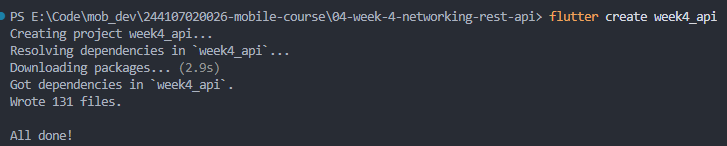
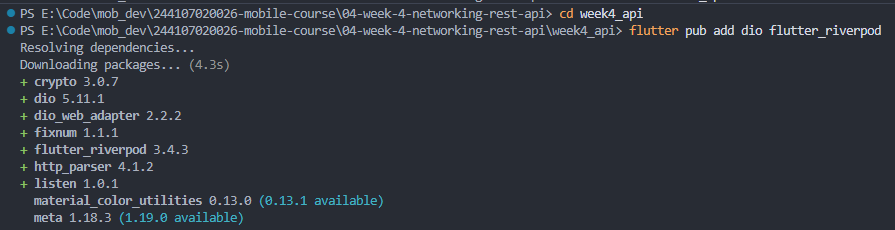
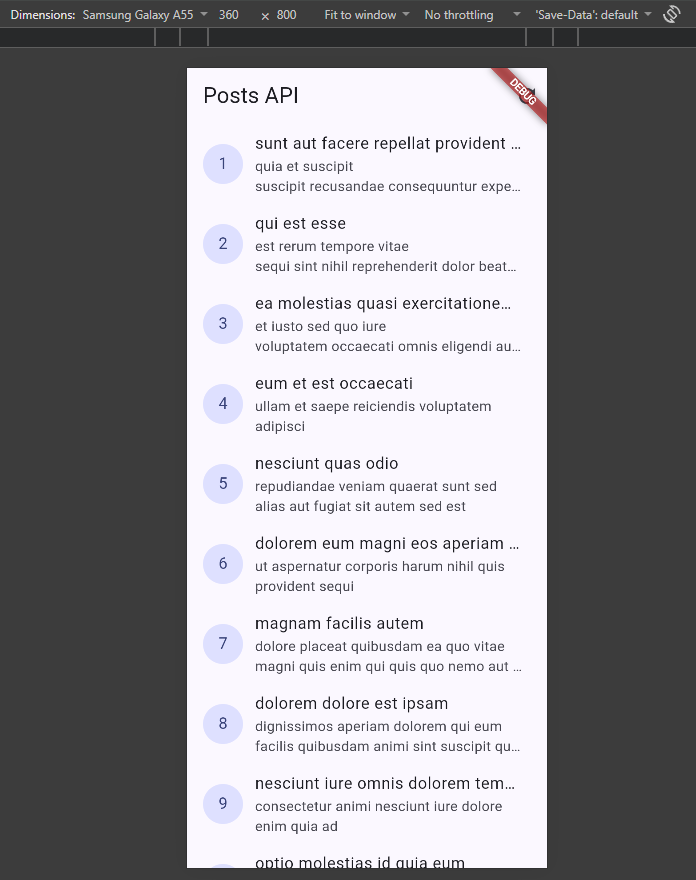
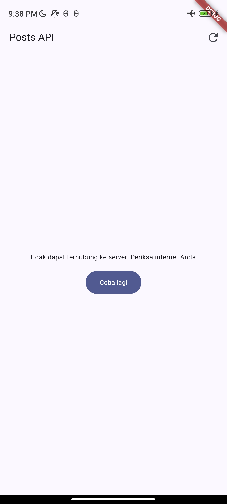
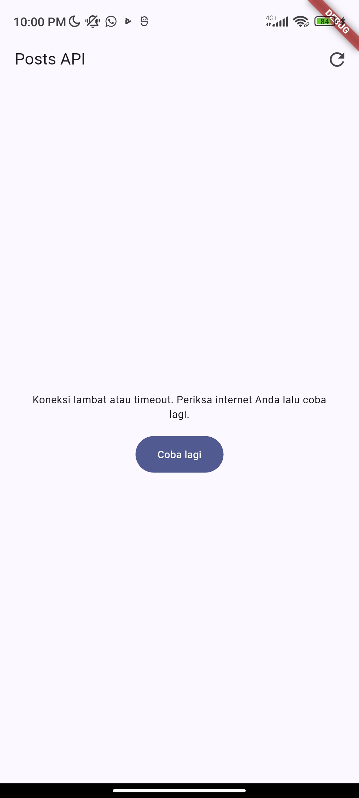

# Praktikum 1 : Dio dan model data

1. Siapkan Project & Struktur Folder

2. Model data dengan fromJson aman null
- Kode ada pada [`lib/data/models/post.dart`](week4_api/lib/data/models/post.dart)

3. Konfigurasi Dio terpusat
- Kode ada pada [`lib/data/api_client.dart`](week4_api/lib/data/api_client.dart)

4. Repository sebagai pintu data
- Kode ada pada [`lib/data/repositories/post_repository.dart`](week4_api/lib/data/repositories/post_repository.dart)

# Praktikum 2: Provider dan error handling

1. Provider AsyncNotifier + pesan error ramah pengguna
- Kode ada pada [`lib/data/providers.dart`](week4_api/lib/data/providers.dart)

2. UI: loading, error, empty, success
- Kode ada pada [`lib/pages/post_list_page.dart`](week4_api/lib/pages/post_list_page.dart)

3. Entry point dengan ProviderScope
- Kode ada pada [`lib/main.dart`](week4_api/lib/main.dart)

## Uji tiga skenario error

1. Jalankan aplikasi dengan internet normal, amati loading lalu daftar 100 posts.

2. Matikan internet (mode pesawat), tekan refresh, amati pesan ramah + tombol Coba lagi. Nyalakan kembali internet, tekan Coba lagi.

3. Sementara ubah baseUrl menjadi URL salah, amati pesan error koneksi. Kembalikan setelah uji.

