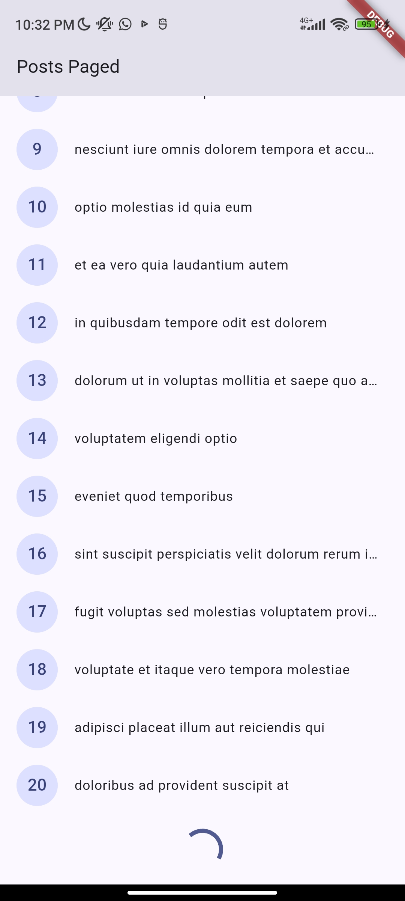
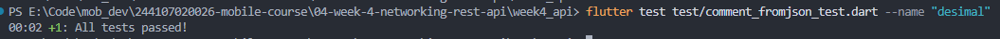

# Praktikum 1 : Dio dan model data

1. Siapkan Project & Struktur Folder

2. Model data dengan fromJson aman null
- Kode ada pada [`lib/data/models/post.dart`](week4_api/lib/data/models/post.dart)

3. Konfigurasi Dio terpusat
- Kode ada pada [`lib/data/api_client.dart`](week4_api/lib/data/api_client.dart)

4. Repository sebagai pintu data
- Kode ada pada [`lib/data/repositories/post_repository.dart`](week4_api/lib/data/repositories/post_repository.dart)

# Praktikum 2: Provider dan error handling

1. Provider AsyncNotifier + pesan error ramah pengguna
- Kode ada pada [`lib/data/providers.dart`](week4_api/lib/data/providers.dart)

2. UI: loading, error, empty, success
- Kode ada pada [`lib/pages/post_list_page.dart`](week4_api/lib/pages/post_list_page.dart)

3. Entry point dengan ProviderScope
- Kode ada pada [`lib/main.dart`](week4_api/lib/main.dart)

## Uji tiga skenario error

1. Jalankan aplikasi dengan internet normal, amati loading lalu daftar 100 posts.

2. Matikan internet (mode pesawat), tekan refresh, amati pesan ramah + tombol Coba lagi. Nyalakan kembali internet, tekan Coba lagi.

3. Sementara ubah baseUrl menjadi URL salah, amati pesan error koneksi. Kembalikan setelah uji.

# Praktikum 3: Pagination dasar

1. Repository paginated
- Kode ada pada [`lib/data/repositories/post_repository.dart`](week4_api/lib/data/repositories/post_repository.dart)

2. Notifier dengan state halaman
- Kode ada pada [`lib/data/paged_posts.dart`](week4_api/lib/data/paged_posts.dart)

3. Notifier dengan state halaman (lanjutan)
- Kode ada pada [`lib/data/paged_posts.dart`](week4_api/lib/data/paged_posts.dart)

4. UI infinite scroll
- Kode ada pada [`lib/pages/paged_post_page.dart`](week4_api/lib/pages/paged_post_page.dart)

## Ubah home di main.dart menjadi PagedPostPage, jalankan, dan scroll sampai bawah. Amati: halaman 1 tampil dulu, indikator muncul, data bertambah tanpa reload penuh.

# AI Challenge

## Prompt : 
- Buatkan repository layer Flutter untuk endpoint GET /comments?postId={id} dari JSONPlaceholder menggunakan Dio + flutter_riverpod.
Requirements:
- Model Comment dengan fromJson aman null (postId, id, name, email, body).
- CommentRepository dengan method fetchComments(postId) + timeout 10 detik.
- AsyncNotifierProvider dengan penanganan error otomatis (AsyncError) dan fungsi pesan error ramah pengguna untuk timeout, connection error, 404, dan 500.
- Satu unit test untuk fromJson dengan field yang hilang.
Jelaskan setiap bagian kode dalam komentar.

## Checklist : 
Sebelum kode AI diterima, verifikasi hal berikut dan catat temuan Anda di README:

1. Apakah UI memanggil Dio secara langsung (dilarang) atau lewat repository?
- Hasilnya adalah UI tidak memanggil dio secara langsung. Alirannya juga benar yaitu dari UI - Provider - Repository - Dio.

2. Apakah fromJson aman null, atau masih memakai cast langsung yang bisa crash?
- Hasilnya adalah fromJson aman dari null, kedua model sudah pakai 'as Type?' untuk memastikan jika field hilang atau null maka akan return null dan bukan 'TypeError'

3.  Apakah semua tipe DioExceptionType (timeout, connectionError, badResponse) dipetakan ke pesan pengguna?
- Iya, semua tipe DIoExceptionType sudah digunakan, semua kode bisa dilihat di comment_providers.dart. 

4. Apakah baseUrl/timeout terpusat di satu client, bukan tersebar di tiap method?
- baseUrl ada di satu client yaitu di api_client.dart (AI tidak membuat client baru).

5.  Apakah test AI benar-benar menguji kasus field hilang, atau hanya happy path? Tambahkan minimal 1 edge case sendiri.
- Tes AI sudah menguji kasus field hilang, semua tes ada di test/comment_fromjson_test.dart. hasilnya adalah 4 edge case (JSON kosong, parsial, null eksplisit, round-trip) sudah berhasil.
- Edge case tambahan : ada di file test/comment_fromjson_test.dart line 118

6. Jalankan flutter analyze dan flutter test, apakah hasil AI lolos tanpa warning?
- flutter analyze : gagal (4 issues), msalah utama di comment_providers.dart masih pakai kode lama Riverpod 2 (AsyncNotifierProviderFamily dan parameter di build()) yang sudah tidak support
- flutter test : 5 berhasil 1 gagal, widget_test.dart gagal karena masih memeriksa fitur counter bawaan template yang sudah tidak dipakai

## Perbaikan yang dilakukan :
1. build(int postId) ubah ke build(int arg)
2. AsyncNotifierProviderFamily<...>() ubah ke CommentListNotifier(arg), ...
3. widget_test.dart : hapus test boilerplate counter bawaan yang sudah tidak bisa digunakan