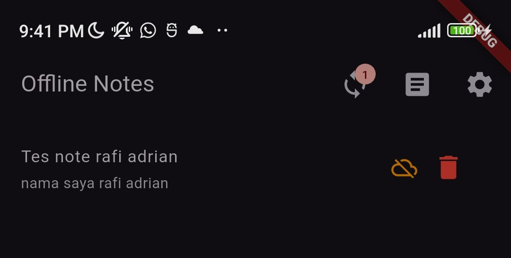
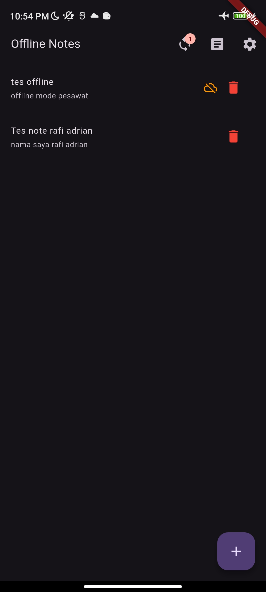
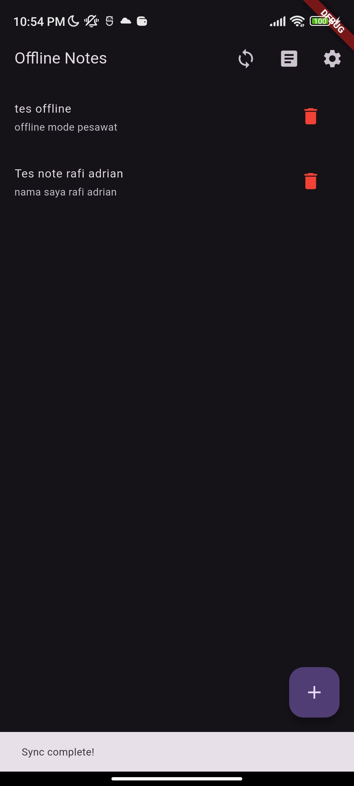
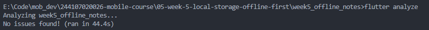
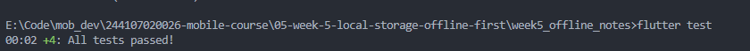

# Praktikum 1: SharedPreferences

1. Siapkan Project & Struktur Folder

2. Repository preferensi
- Kode ada pada [`lib/data/prefs.dart`](week5_offline_notes/lib/data/prefs.dart)

3. Provider dan halaman pengaturan
- Kode ada pada [`lib/pages/settings_page.dart`](week5_offline_notes/lib/pages/settings_page.dart)

# Praktikum 2: SQLite dan repository catatan

1. Model catatan

- Kode ada pada [`lib/data/local/note.dart`](week5_offline_notes/lib/data/local/note.dart)

2. Pembuka database
- Kode ada pada [`lib/data/local/db.dart`](week5_offline_notes/lib/data/local/db.dart)

3. Repository sebagai satu-satunya pintu data
- Kode ada pada [`lib/data/repositories/note_repository.dart`](week5_offline_notes/lib/data/repositories/note_repository.dart)

4. Halaman catatan offline

# Praktikum 3: Cache-first dan antrean sync

1. Cache-first read untuk data API
- Kode ada pada [`lib/data/sync.dart`](week5_offline_notes/lib/data/sync.dart)

2. Sinkronisasi catatan kotor (dirty)
- Kode ada pada [`lib/data/providers.dart`](week5_offline_notes/lib/data/providers.dart)

3. Simulasi offline yang deterministik
- Matikan Wi-Fi / aktifkan mode pesawat, buka kembali aplikasi: catatan tetap tampil, badge dirty tetap akurat.

- Nyalakan kembali koneksi, jalankan syncNotes: badge kembali ke 0.

- Tuliskan langkah dan hasil observasi Anda (screenshot sebelum/sesudah) ke folder screenshots/

# AI Challenge
## Prompt : 
Aplikasi Flutter Offline Notes: CRUD catatan + preferensi tema. Bandingkan SharedPreferences, Hive, sqflite (SQLite), dan Drift untuk dua kebutuhan ini. Requirements:
- Kriteria: kompleksitas query, kebutuhan relasi, reaktivitas (stream) type-safety, ukuran boilerplate, dan kemudahan testing.
- Beri rekomendasi final: mana untuk preferensi, mana untuk catatan, beserta alasannya dalam 1 tabel.
- Tunjukkan skema tabel/kotak untuk 1000+ catatan.
Jelaskan trade-off setiap pilihan.

## Checklist : 
Sebelum rekomendasi AI diterima, verifikasi dan catat temuan Anda di README:

1. Apakah AI menempatkan daftar catatan di SharedPreferences? (menolak: rapuh untuk koleksi).
- Tidak, AI menempatkan SharedPreferences murni hanya untuk pengaturan (Tema dan Last Opened)

2. Apakah skema AI mendukung antrean sync (dirty flag / updated_at) atau hanya CRUD polos?
- Iya, Skema mendukung dirty flag bertipe int dan updated_at bertipe TEXT. Keduanya berguna untuk mendeteksi catatan mana yang harus dipush saat koneksi aktif

3. Apakah klaim "real-time" AI didukung stream (Drift/watch) atau hanya asumsi?
- Didukung secara asli, drift memiliki fungsi .watch() yang berjalan secara reaktif mengembalikan Stream<List<Data>>. sqflite biasa tidak memiliki ini sehingga kita harus menggunakan Riverpod Invalidation

4. Apakah estimasi boilerplate AI masuk akal setelah Anda mencoba instalasinya (flutter pub add + migrasi skema)?
- Cukup masuk akal, sqflite membutuhkan mapping manual dari Map ke Dart Class, tetapi tidak membutuhkan code generation. Sementara Drift dan Hive membutuhkan setup tambahan build_runner yang membuat boilerplate awal menjadi cukup tinggi

5. Keputusan final Anda beserta alasannya, boleh berbeda dari rekomendasi AI selama berargumen.
- Keputusan akhir saya sepakat dengan hasil rekomendasi yaitu menggunakan SharedPreferences untuk dark mode dan sqflite untuk Catatan

# Refactor & Testing

1. Ekstrak baris catatan menjadi widget NoteTile tersendiri yang menampilkan badge "belum tersinkron" bila dirty == true.
- Kode ada pada [`lib/pages/notes_page.dart`](week5_offline_notes/lib/pages/notes_page.dart)

2. Pindahkan logika cache posts dan syncNotes ke file lib/data/sync.dart agar repository tetap fokus pada CRUD.
- Kode ada pada [`lib/data/sync.dart`](week5_offline_notes/lib/data/sync.dart)

3. Tambahkan halaman detail catatan dengan GoRouter (/note/:id) yang membaca dari repository lokal, bukan dari state halaman list.
- Kode ada pada [`lib/pages/note_detail_page.dart`](week5_offline_notes/lib/pages/note_detail_page.dart)

## Checklist verifikasi mandiri

1. UI tidak memanggil SQLite/SharedPreferences langsung; semua lewat repository + provider.
- Iya, UI hanya mengambil data menggunakan provider dari Riverpod, lalu provider tersebut memanggil Repository untuk mengakses database atau SharedPreferences.

2. Aplikasi penuh berfungsi dalam mode pesawat: baca, tambah, hapus catatan.
- Iya, berfungsi 100%. Semua aktivitas membuat, membaca, dan menghapus catatan langsung disimpan secara lokal di dalam database SQLite pada HP. Tidak ada proses yang tertahan meski tidak ada koneksi internet.

3. Badge dirty akurat sebelum/sesudah sync; cache posts tampil tanpa internet.
- Iya, sudah akurat. Jika menambah catatan saat offline, badge peringatan angka akan bertambah. Setelah tombol sync ditekan, angka badge kembali menjadi 0. Fitur Cached Posts juga aman, tombol "Offline" bisa dinyalakan dan posts akan tetap muncul mengambil dari cache lama yang tersimpan.

4. flutter analyze tanpa issue dan semua test lulus.
- flutter analyze bersih (No issues found). Tes unit pada data dan repository (termasuk FakeNoteRepository) juga seluruhnya berjalan sukses dan passed.

5. Hasil AI diverifikasi dan didokumentasikan pada folder docs/.
- Ya, seluruh hasil AI Challeng, tabel perbandingan arsitektur penyimpanan (SharedPreferences, Hive, SQLite, Drift), dan analisis verifikasi telah saya simpan di file docs/AI_CHALLENGE.md.

## Testing: unit test model + repository palsu
1. Buat test/note_test.dart. Uji mapping aman null dan provider dengan repository palsu (tanpa SQLite sungguhan):
- Kode ada pada [`test/note_test.dart`](week5_offline_notes/test/note_test.dart)

2. Jalankan:
flutter analyze

flutter test

# Tugas, refleksi, dan referensi

## Mini project / Industry Challenge (Sudah dikerjakan diatas)

## Refleksi
1. Mengapa daftar catatan tidak boleh disimpan di SharedPreferences? Apa yang rusak jika aturan ini dilanggar?
- SharedPreferences bukan untuk data koleksi. Menyimpan seluruh catatan sebagai JSON raksasa membuat proses baca/tulis lambat, boros memori, tidak mendukung query sebagian (seperti WHERE dirty = 1), dan rentan korup jika aplikasi crash

2. Kapan cache-first cukup, dan kapan Anda membutuhkan strategi lain (misalnya network-first untuk data harga real-time)?
- Cache-first cocok untuk data yang menoleransi delay (seperti berita atau catatan). Network-first wajib untuk data real-time (seperti saham atau saldo) agar pengguna tidak mendapat informasi yang menyesatkan

3. Bagaimana dirty flag berubah menjadi antrean sync tanpa memblokir UI? Kapan antrean terpisah (tabel outbox) menjadi perlu?
- dirty flag memperbarui UI seketika sementara sinkronisasi berjalan di background. Tabel outbox dibutuhkan untuk melacak aksi spesifik (seperti operasi DELETE), karena dirty flag tidak bisa melacak data yang sudah dihapus dari lokal

4. Bagian mana dari rekomendasi AI yang Anda tolak, dan mengapa?
- Menolak rekomendasi penggunaan Hive. Hive memuat semua data ke memori (boros RAM untuk catatan panjang) dan tidak mendukung query SQL yang dibutuhkan untuk mekanisme offline-first yang efisien